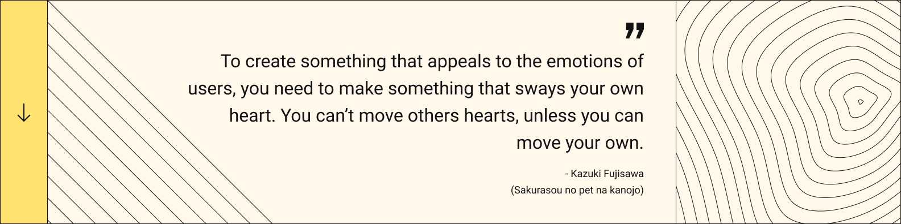

```javascript
let joevtap = {
    age: 19,
    country: 'Brazil',
    city: 'Itajubá, MG',
    interests: ['User Exeperience', 'Developer Experience', 'Cloud Computing', 'Edge Computing', 'Data Science', 'Machine Learning'],
    languages: ['C', 'Python', 'Typescript'],
    hobbies: ['Anime', 'Gaming', 'Creating anything interesting'],
};
```

<a href = "mailto: joelvitortorres@gmail.com"></a>
<a href="https://www.linkedin.com/in/joevtap/" target="_blank"></a>
<a href="https://twitter.com/joevtap" target="_blank"></a>
<a href="https://instagram.com/joevtap" target="_blank"></a>

<h3>I little bit about me:</h3>

<p align="left">
    🔭 I’m currently working on my UX Design portfolio and my feature rich CLI called "faisca"
</p>
<p align="left">
    📫 How to reach me: <a href = "mailto: joelvitortorres@gmail.com"> e-mail </a> | @joevtap - in almost every social media
</p>
<br/>
    


