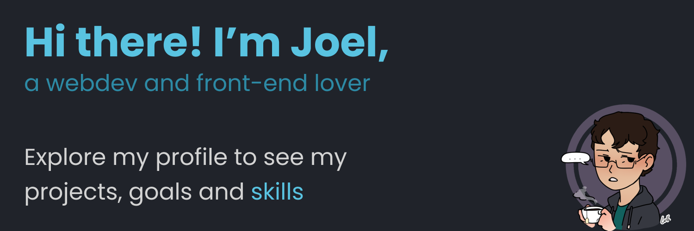

<h3>I little bit about me:</h3>

    🔭 I’m currently working on improving my development skills

    🌱 I’m currently learning web development with the PERN stack

    🙋🏻‍♂️ I’m looking to collaborate on projects that will give me experience

    📫 How to reach me: <a href = "mailto: joelvitortorres@gmail.com"> e-mail </a> | @joevtap - in almost every social media

 

